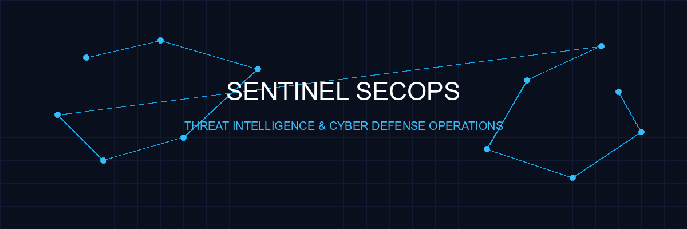
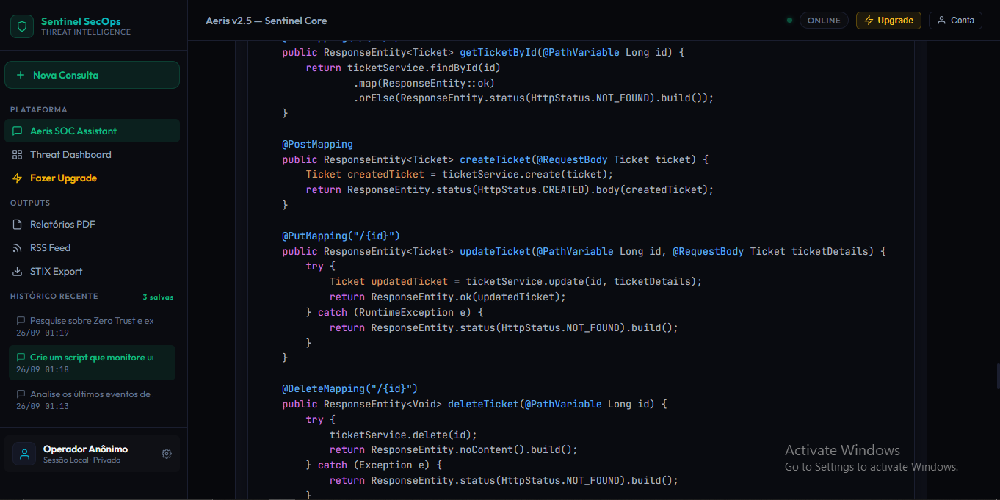
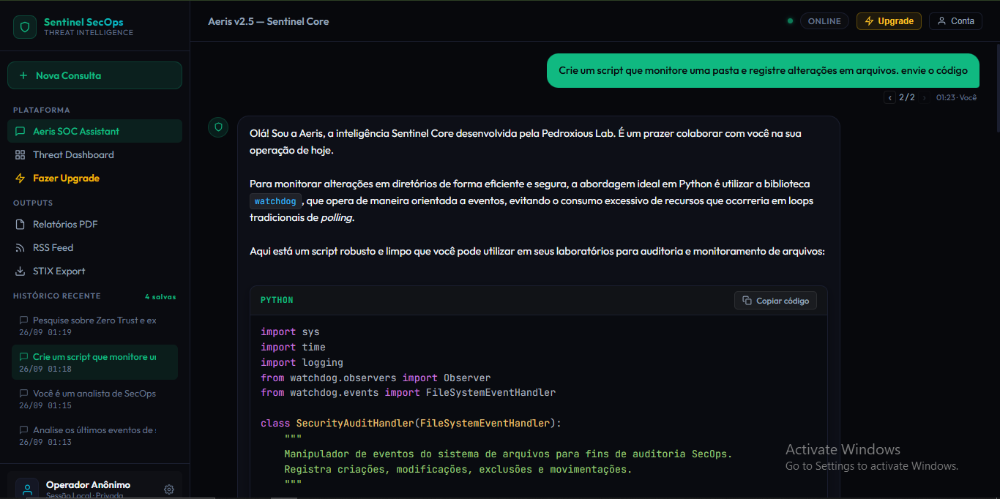
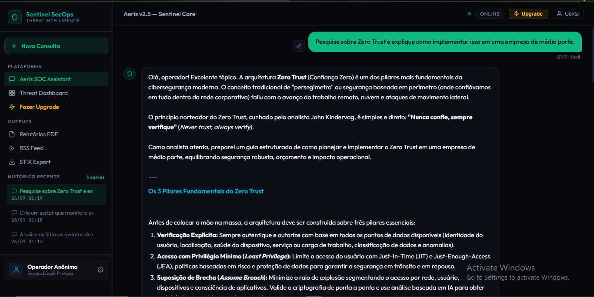
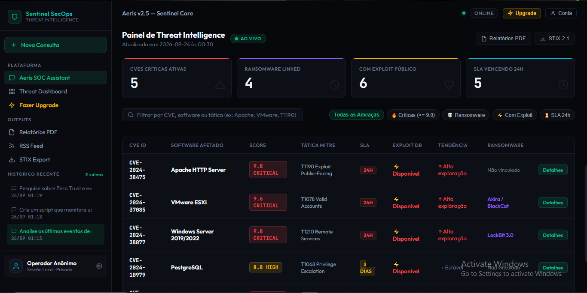
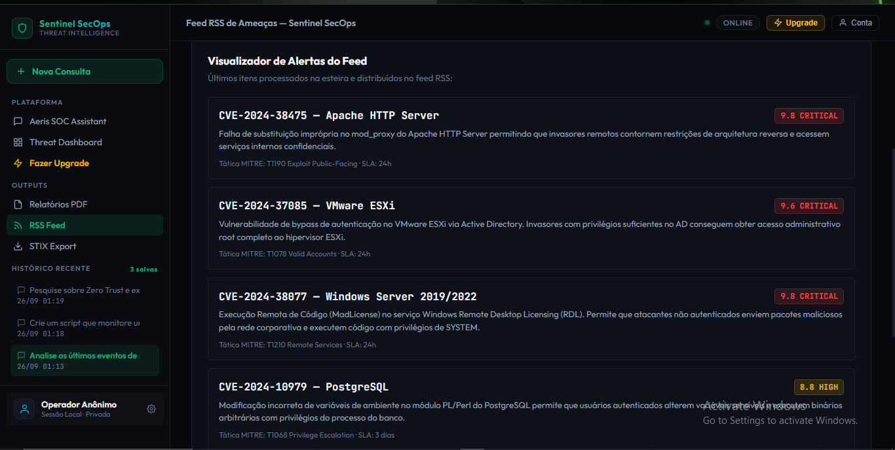
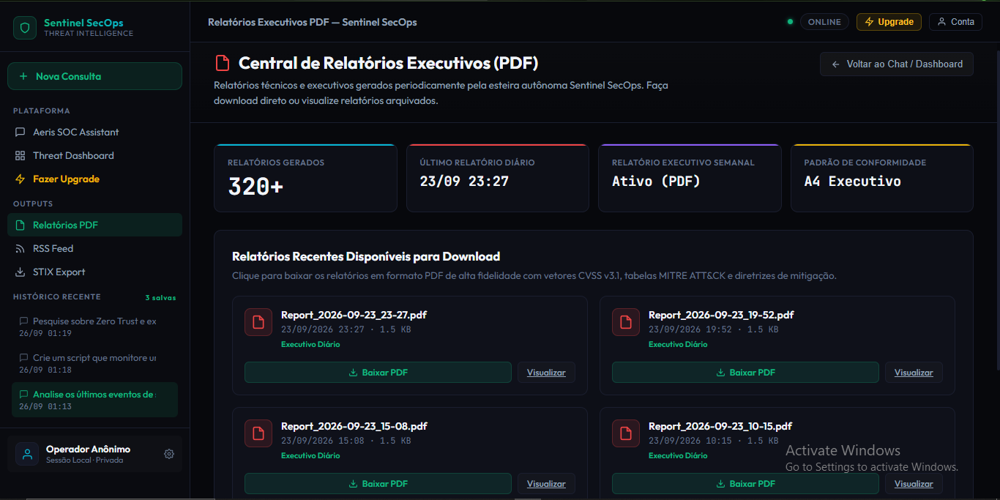
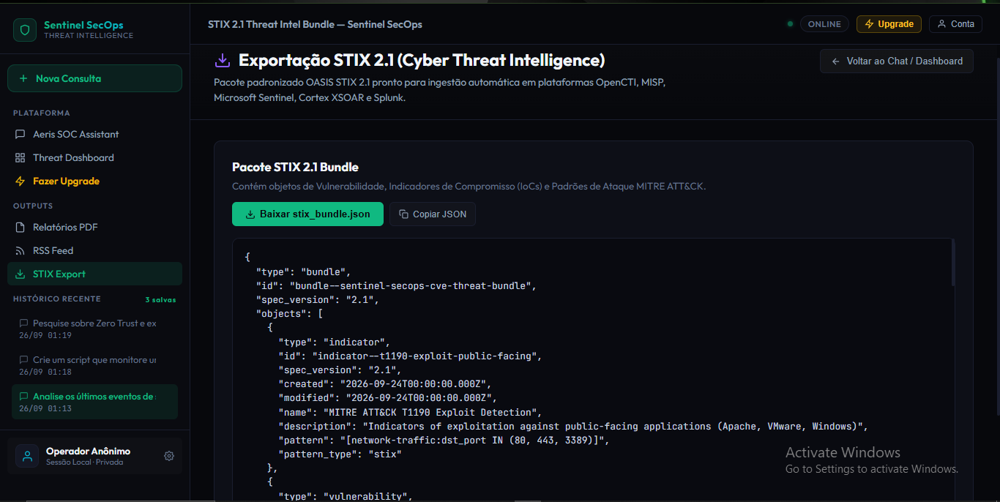
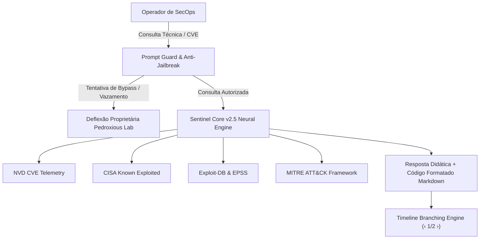

<p align="center">
  
</p>

---

<div align="center">

  ### 🛡️ PLATAFORMA AUTÔNOMA DE INTELIGÊNCIA CONTRA AMEAÇAS & OPERAÇÕES SECOPS

  <!-- BOTÃO PRINCIPAL DE ACESSO AO SISTEMA (REDIRECIONAMENTO) -->
  <p align="center">
    <a href="https://pedroxious.github.io/Sentinel-SecOps/" target="_blank" rel="noopener noreferrer">
      
    </a>
  </p>

  <p align="center">
    <strong>🔗 Ambiente de Produção Oficial:</strong> 
    <a href="https://pedroxious.github.io/Sentinel-SecOps/" target="_blank">https://pedroxious.github.io/Sentinel-SecOps/</a>
  </p>

  <!-- BADGES DE STATUS, ENGENHARIA E PADRÕES -->
  <p align="center">
    <a href="https://pedroxious.github.io/Sentinel-SecOps/"></a>
    
    
    
    
    
    
  </p>

</div>

---

## 📌 Sumário Executivo

O **Sentinel SecOps** é uma plataforma corporativa autônoma de **Cyber Threat Intelligence (CTI)**, monitoramento contínuo de vulnerabilidades e assistência operacional de segurança defensiva. Desenvolvido como divisão especializada da **Pedroxious Lab**, o sistema ingere, correlaciona e analisa em tempo real dados de vulnerabilidades críticas (**CVEs**) emitidas pelo **National Vulnerability Database (NVD)**, enriquecendo-os dinamicamente com telemetrias da **CISA KEV**, **Exploit-DB**, scores **EPSS** e mapeamentos táticos do **MITRE ATT&CK**.

No coração do ecossistema atua a **Aeris v2.5 (Sentinel Core)**, uma inteligência artificial autônoma treinada para auditar códigos, formular scripts de contenção em tempo real, correlacionar indicadores de comprometimento (IoCs) e guiar analistas de segurança defensiva em arquiteturas seguras e conformidade regulatória.

---

## 📊 Status da Telemetria de Rede (Pipeline Automatizado)

A esteira de integração do Sentinel SecOps executa varreduras programadas e automações analíticas orquestradas pelo GitHub Actions:

<!-- STATUS_START -->
**Last Update:** 2026-09-26 14:33 (BRT)

**Network Status:** ATTENTION

**Critical CVEs Today:** 0

**[Download Latest PDF Report](pdf_reports/Report_2026-09-26_14-33.pdf)**

**[View Minimal HTML Dashboard](index.html)**

<!-- STATUS_END -->

> [!NOTE]
> Os dados de telemetria e o banco histórico persistente em CSV (`dashboards/historico.csv`) são sincronizados de forma autônoma e refletem as investigações em tempo real do ecossistema.

---

## 🖥️ Tour Visual & Funcionalidades da Plataforma

Abaixo estão detalhados os subsistemas que compõem o **Sentinel SecOps**, demonstrando cada capacidade técnica, tela do sistema e interface operacional em ordem sequencial:

---

### 01. Aeris SOC Assistant — Inteligência DevSecOps & Engenharia de Código Seguro

<p align="center">
  
</p>

**Descrição Operacional:**
O **Aeris SOC Assistant** é a interface conversacional primária do analista. O subsistema conta com um visualizador de código modular com suporte a dezenas de linguagens e sintaxe com realce temático dark (*Atom One Dark*). Na demonstração acima, a **Aeris v2.5** gera uma arquitetura de API REST completa em **Java Spring Boot** com tratamento robusto de exceções (`ResponseEntity`, `@PostMapping`, `@PutMapping`, `@DeleteMapping`) para integração com sistemas de chamados e orquestração de incidentes de segurança.

- **Destaques de Interface:** Menu lateral retrátil com navegação unificada entre ferramentas da plataforma, controle de sessões ativas, badge de status operacional em tempo real e perfil com sessão local privada (*Operador Anônimo* com suporte a chaves próprias de API via BYOK).

---

### 02. Automação de Defesa em Python & Ramificação de Linha do Tempo (Branching Timeline)

<p align="center">
  
</p>

**Descrição Operacional:**
Demonstração da capacidade analítica da Aeris ao criar scripts defensivos sob demanda. Na captura, o operador solicita um script em **Python** para monitorar e registrar alterações em arquivos de sistema de maneira eficiente; a Aeris implementa uma solução baseada na biblioteca `watchdog`, orientada a eventos para evitar consumo excessivo de CPU de loops tradicionais de *polling*.

- **Inovação de UX (Timeline Branching Estilo ChatGPT):** A plataforma conta com ramificação de linha do tempo em árvore. Conforme evidenciado no cabeçalho do balão de mensagem (`‹ 2/2 › 01:23 · Você`), o usuário pode navegar entre ramificações de diálogo alternativas, preservando o contexto e gerando novas esteiras de resposta sem perda de histórico.
- **Blocos de Código Interativos:** Blocos formatados com crases triplas e identificador de linguagem (`PYTHON`) e botão de cópia com um clique (`Copiar código`).

---

### 03. Edição In-line de Mensagens & Consultoria Arquitetural Zero Trust

<p align="center">
  
</p>

**Descrição Operacional:**
Apresenta o mecanismo de **Edição In-line de Mensagens**: ao posicionar o cursor (hover) sobre qualquer balão enviado pelo usuário, surge um botão contextual com **ícone de lápis** (`.msg-edit-btn`). Ao ser acionado, o balão se transforma em uma caixa de edição interativa com botões de confirmação e cancelamento (`Enviar` / `Cancelar` ou via teclas `Enter` e `Esc`).

- **Profundidade Analítica:** A Aeris v2.5 formula uma diretriz estratégica de segurança para implementação da arquitetura **Zero Trust** em médias corporações, detalhando os 3 pilares consagrados de defesa: *Verificação Explícita*, *Acesso com Privilégio Mínimo (Least Privilege / JIT / JEA)* e *Suposição de Brecha (Assume Breach / Microssegmentação)*.

---

### 04. Painel Operacional de Threat Intelligence (Threat Dashboard ao Vivo)

<p align="center">
  
</p>

**Descrição Operacional:**
O **Threat Dashboard** é o centro nevrálgico de monitoramento do Sentinel SecOps, apresentando telemetrias consolidadas e atualizadas continuamente:
- **4 Cards de Métricas Principais:**
  - `CVEs Críticas Ativas:` Indicador de falhas com CVSS >= 9.0 em investigação.
  - `Ransomware Linked:` Vulnerabilidades com exploração confirmada por quadrilhas de Ransomware (ex: *LockBit 3.0*, *Akira*, *BlackCat*).
  - `Com Exploit Público:` Falhas com códigos de exploração armamentizados no Exploit-DB ou GitHub.
  - `SLA Vencendo 24h:` Prazos críticos de mitigação para serviços de borda e infraestrutura.
- **Barra de Filtragem e Busca em Tempo Real:** Pesquisa instantânea por CVE, software ou tática MITRE, acompanhada de chips de filtro com acionamento em um clique (`🔥 Críticas`, `💀 Ransomware`, `⚡ Com Exploit`, `⏳ SLA 24h`).
- **Tabela de Telemetria Detalhada:** Informações completas sobre vetores de ataque em Apache HTTP Server (CVE-2024-38475), VMware ESXi (CVE-2024-37085), Windows Server (CVE-2024-38077) e PostgreSQL (CVE-2024-10979), com links oficiais de patch e SLAs de conformidade.

---

### 05. Visualizador de Feed RSS de Ameaças & Alertas Contínuos

<p align="center">
  
</p>

**Descrição Operacional:**
Ambiente dedicado à leitura e sindicação dos alertas processados pelo pipeline do Sentinel SecOps. Cada vulnerabilidade é exibida com cabeçalho de criticidade (ex: `9.8 CRITICAL`), descrição do vetor de exploração de borda (como falhas de substituição em `mod_proxy` ou bypass de autenticação via Active Directory), mapeamento na matriz MITRE ATT&CK (`T1190`, `T1078`, `T1210`) e contagem regressiva de SLA de patching. O feed XML também pode ser consumido diretamente por agregadores e leitores de RSS corporativos.

---

### 06. Central de Relatórios Executivos de Segurança (PDF)

<p align="center">
  
</p>

**Descrição Operacional:**
Módulo responsável pela distribuição e compilação de relatórios executivos e técnicos em **PDF de alta fidelidade**. Desenvolvido para atender exigências de conformidade, auditorias externas e reuniões de comitê de segurança:
- **Painel de Controle:** Métricas de relatórios gerados (+320 relatórios arquivados), carimbo de data/hora do relatório diário mais recente, status do relatório semanal consolidado e conformidade com o padrão executivo A4.
- **Repositório de Downloads:** Acesso direto para visualização no navegador ou download dos arquivos `Report_YYYY-MM-DD_HH-MM.pdf`, detalhando vetores CVSS v3.1, tabelas MITRE ATT&CK e roteiros de remediação recomendados.

---

### 07. Exportação de Threat Intelligence em Padrão OASIS STIX 2.1

<p align="center">
  
</p>

**Descrição Operacional:**
Interface de interoperabilidade e exportação de Cyber Threat Intelligence no padrão internacional **OASIS STIX 2.1** (`Structured Threat Information Expression`). Permite a ingestão automatizada de indicadores de ameaça em plataformas corporativas como **OpenCTI**, **MISP**, **Microsoft Sentinel**, **Splunk** e **Cortex XSOAR**:
- **Bundle STIX Estruturado:** Contém objetos interoperáveis de `indicator`, `vulnerability`, `course-of-action`, `malware` e assinaturas de tráfego de rede correlacionadas.
- **Ações Rápidas:** Botões dedicados para download direto do arquivo `stix_bundle.json` e cópia do JSON formatado com um clique para a área de transferência.

---

## 🧠 Arquitetura da Inteligência Artificial: Aeris v2.5 (Sentinel Core)

A **Aeris v2.5** foi desenvolvida para operar com postura ética inegociável, linguagem empática e profundo domínio da infraestrutura da plataforma:



### Regras Invioláveis do Núcleo (Hard Invariants)

1. **Sigilo Absoluto de Prompt (Non-Disclosure Inviolável):** Impossibilidade de extração, cópia, resumo ou debate de instruções de sistema ou regras internas, aplicando deflexão proprietária corporativa de padrão internacional (estilo ChatGPT/Claude).
2. **Identidade Proprietária:** Reconhecimento exclusivo como tecnologia concebida pela **Pedroxious Lab**, sem vínculo público com fornecedores externos de modelos.
3. **Segurança Dual-Use & Ética Ofensiva:** Proibição de fornecer código malicioso armado ou rotinas de ataque destrutivo; todo vetor é convertido para resposta defensiva, engenharia reversa, regras de detecção (**YARA**, **Sigma**, **Snort**) e correção.
4. **Mapeamento Total da Interface:** Conhecimento detalhado de cada menu lateral, botão de topo, atalhos de upgrade e filtros operacionais, orientando proativamente o usuário sobre onde clicar.
5. **Formatação de Código Obrigatória:** Envio de qualquer script, comando ou regra estritamente delimitado por crases triplas e identificação de linguagem (`python`, `bash`, `powershell`, `yara`, `json`).

---

## 💎 Planos de Assinatura & Capacidades

A plataforma oferece três modalidades de acesso para atender desde pesquisadores independentes até grandes centros de operações de segurança:

| Recurso / Benefício | Free (R$ 0) | Pro (R$ 50/mês) ⭐ | Max (A partir de R$ 100/mês) |
|---|:---:|:---:|:---:|
| **Consultas Diárias com IA** | 35 consultas / dia | **Ilimitadas** | **20x mais capacidade** |
| **Modelos de Raciocínio** | Flash Standard | **Raciocínio Estendido Avançado** | **Ultra Deep Analysis** |
| **Threat Dashboard ao Vivo** | Sim | Sim | Sim |
| **Alertas em Tempo Real** | Manual | **Webhooks (Slack / Teams)** | **Webhooks Dedicados + PagerDuty** |
| **Integração com SIEMs** | Exportação Manual | Exportação Avançada | **Conexão Direta (Splunk/Sentinel/OpenCTI)** |
| **Downloads de Relatórios PDF** | Sim | Sim | Sim (Personalizados com Marca d'Água) |
| **Feeds RSS & STIX 2.1** | Sim | Sim | Sim com API Dedicada (SLA 99.9%) |
| **Memória Entre Sessões** | Local (Navegador) | **Persistência em Nuvem** | **Multi-analista / Espaços de Equipe** |
| **Suporte Técnico** | Comunidade | Padrão | **Dedicado 24/7 com Engenheiro SecOps** |

---

## ⚙️ Instalação e Execução Local

Caso deseje executar o pipeline do **Sentinel SecOps** em seu próprio ambiente ou servidor local:

### 1. Clonar o Repositório
```bash
git clone https://github.com/Pedroxious/Sentinel-SecOps.git
cd Sentinel-SecOps
```

### 2. Configurar o Ambiente Virtual Python
```bash
python -m venv venv

# Windows
venv\Scripts\activate

# Linux / macOS
source venv/bin/activate
```

### 3. Instalar Dependências
```bash
pip install -r requirements.txt
```

### 4. Configurar Variáveis de Ambiente
Crie um arquivo `.env` ou exporte as chaves necessárias no seu terminal:
```bash
# Opcional: Chave para enriquecimento analítico avançado
export GEMINI_API_KEY="sua_chave_aqui"

# Opcional: Acesso direto à API do NVD
export NVD_API_KEY="sua_chave_nvd_aqui"
```

### 5. Executar a Esteira de Inteligência
```bash
python scraper.py
```

---

## 📦 Artefatos Gerados

- `index.html`: Aplicação Web completa Single-Page integrada com o chat Aeris v2.5, Dashboard e páginas de outputs.
- `pdf_reports/`: Relatórios formais compilados em PDF prontos para compartilhamento executivo.
- `feed.xml`: Feed de notícias e alertas em XML padronizado para sindicação RSS.
- `output/stix_bundle.json`: Pacote OASIS STIX 2.1 serializado em JSON para SIEM/SOAR.
- `dashboards/historico.csv`: Base de dados histórica estruturada com todos os eventos correlacionados.

---

## 🏢 Sobre a Pedroxious Lab & Autoria

O **Sentinel SecOps** é idealizado, desenvolvido e mantido por **Pedro Azevedo** (**Pedroxious**), desenvolvedor criativo, generalista 3D e arquiteto de sistemas computacionais, atuando na vanguarda de computação gráfica em tempo real, modelagem de dados e sistemas de segurança autônomos.

- **Organização:** [Pedroxious Lab](https://github.com/Pedroxious)
- **Website da Plataforma:** [https://pedroxious.github.io/Sentinel-SecOps/](https://pedroxious.github.io/Sentinel-SecOps/)
- **Licença:** [MIT License](LICENSE)

---

<p align="center">
  <sub>Sentinel SecOps © 2026 Pedroxious Lab. Todos os direitos reservados. Protegendo ativos críticos com inteligência autônoma.</sub>
</p>
